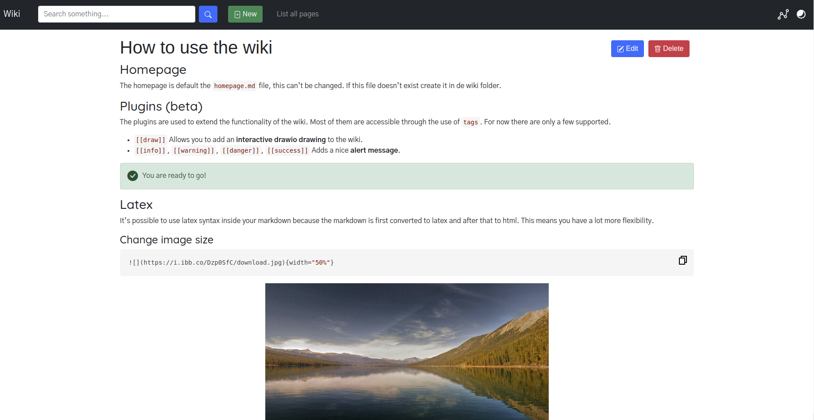

# wikmd 
   
> :information_source: **Information** can be found in the docs: [https://linbreux.github.io/wikmd/](https://linbreux.github.io/wikmd/)

## What is it?
It’s a file-based wiki that aims to simplicity. Instead of storing the data in a database I chose to have a file-based system. The advantage of this system is that every file is directly readable inside a terminal etc. Also when you have direct access to the system you can export the files to anything you like.

To view the documents in the browser, the document is converted to html.

## Features

- knowledge graph
- **NEW** plugin system: drawio integration, alerts, embedded pages, swagger, plantuml
- git support (version control)
- image support including sizing and referencing
- math/latex
- code highlight
- file searching
- file based
- dark theme
- codemirror for editing
- password protection

[Using the wiki](https://linbreux.github.io/wikmd/Using%20the%20wiki.html)

## Installation

Detailed installation instruction can be found [here](https://linbreux.github.io/wikmd/installation.html).

## Development

Instructions on the easiest way to develop on the project can be found [here](https://linbreux.github.io/wikmd/development.html).

## Plugins & Knowledge graph (beta)

More info can be found in the [docs](https://linbreux.github.io/wikmd/knowledge%20graph.html).

