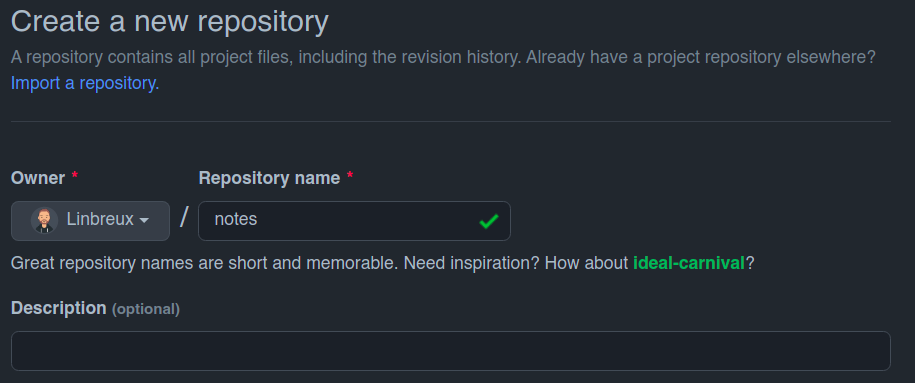

It's possible to connect Wikmd with an online repo. In this example we will give an example with github.

# Create a new repo on Github



Copy the givin ssh-key, for example:

```
git@github.com:Linbreux/notes.git
```

Go in the wikmd folder to ```wikmd-config.yaml``` and change the following lines

```
sync_with_remote: 1
remote_url: "git@github.com:Linbreux/notes.git"
```

When you add or change a file to your wiki, the repo will be synced.

> Make sure to register your github [ssh-keys](https://docs.github.com/en/authentication/connecting-to-github-with-ssh)

# Connect existing Github repo

Copy the givin ssh-key, for example:

```
git@github.com:Linbreux/notes.git
```

Go in the wikmd folder to ```wikmd-config.yaml``` and change the following lines

```
sync_with_remote: 1
remote_url: "git@github.com:Linbreux/notes.git"
```

When you add or change a file to your wiki, the repo will be synced. Duplicated files from the local and remote repo will be renamed to ```<filename>--copy.md```

> Make sure to register your github [ssh-keys](https://docs.github.com/en/authentication/connecting-to-github-with-ssh)